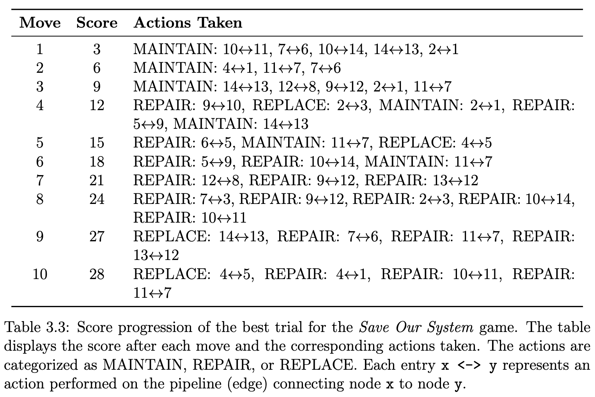

# onr

## Overview
The onr project is a Python application designed to determine the best actions to take to maintain an oil pipeline network. This project was developed as part of a funded Office of Naval Research research initiative led by Dr. Thomas Seager.

## Result



## Installation
To install the required dependencies, run the following command:

```
pip install -r requirements.txt
```

## Usage
To run the application, execute the following command:

```
python src/main.py
```

## Directory Structure
```
onr/
├── src/
│   ├── main.py        # Entry point of the application
│   └── utils/
│       └── helper.py  # Utility functions
├── requirements.txt    # List of dependencies
└── setup.py            # Packaging configuration
```

## Contributing
If you would like to contribute to this project, please fork the repository and submit a pull request.

## License
This project is licensed under the [insert license name, e.g., MIT License].